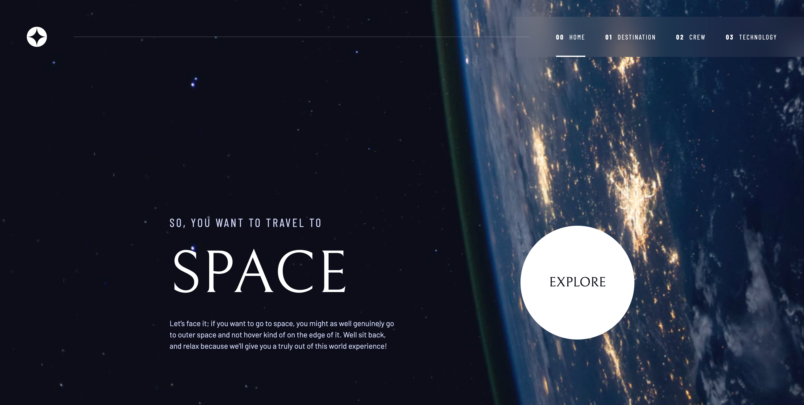

# Scrimba Space Tourism Website (React)

An interactive and responsive **Space Tourism Website** built with **React**.  
This project is based on the [Scrimba Frontend Developer Career Path](https://scrimba.com/learn/frontend) and follows the [Frontend Mentor Space Tourism challenge](https://www.frontendmentor.io/challenges/space-tourism-multipage-website-gRWj1URZ3).  

The app demonstrates **React fundamentals**, dynamic routing, reusable components, and responsive design.

---

## 🚀 Features

- 🌍 **Multi-page navigation** (Home, Destination, Crew, Technology)  
- ⚛️ **Built with React Router** for smooth client-side routing  
- 📱 **Fully responsive** across desktop, tablet, and mobile  
- 🎨 **Modern design system** with reusable styles and components  
- 📂 **Data-driven** UI powered by JSON content  

---

## 🛠️ Tech Stack

- **React** (functional components & hooks)  
- **React Router** (for navigation)  
- **CSS** (custom styles & utility classes)  

---

## 📸 Preview



---

## ⚡ Getting Started

#### 1. Clone the Repository

```bash
git clone https://github.com/BhoomiGohil/Scrimba-Space-Tourism-Website-React.git
cd Scrimba-Space-Tourism-Website-React
```

#### 2. Install Dependencies

```bash
npm install
```

#### 3. Run the App

```bash
npm start
```

#### 4. Build for Production

```bash
npm run build
```

---

## 🙏 Acknowledgements

Scrimba for the course material and guidance and Frontend Mentor for the design inspiration

